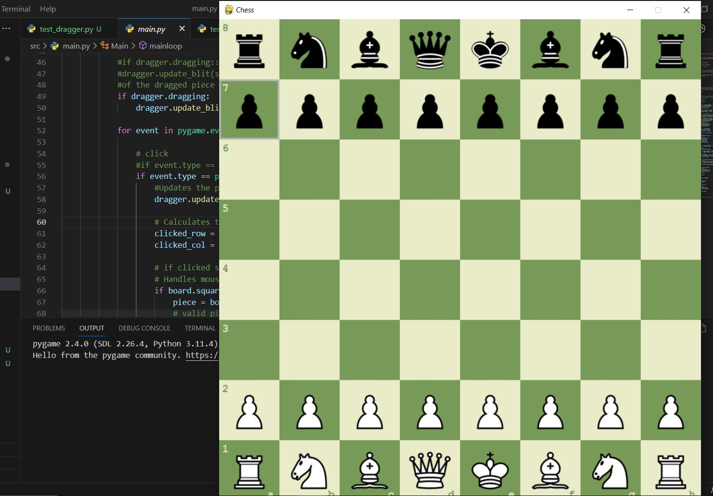

## Chess_Game_Pygame

- This project implements a chess game using the Pygame library, allowing players to enjoy a game of chess with a graphical user interface.

### Features
- Chess game with a user-friendly graphical interface.
- Piece dragging behavior for easy movement.
- Highlighting of valid moves and last moves.
- Sound effects for capturing and moving pieces.
- Ability to change themes and reset the game.
- Prerequisites

### Table of Contents
1. Introduction
2. Piece Classes
3. Board Class
4. Square Class
5. Sound Effects
6. Themes
7. Config Class
8. Installation
9. Usage
10. How to Play
11. Tests

### Introduction
- The Python Chess Game provides an interactive and challenging chess-playing experience. With a user-friendly GUI, players can make moves, explore different strategies, and enjoy the classic game of chess.

### Piece Classes
`Pawn`: Moves forward and captures diagonally.
`Knight`: Moves in an L-shaped pattern.
`Bishop`: Moves diagonally across the board.
`Rook`: Moves horizontally and vertically.
`Queen`: Combines the moves of a rook and a bishop.
`King`: Moves one square in any direction.

### Board Class
- The Board class manages the chessboard, piece placements, move calculations, and special moves. Key features of the Board class include:

- Piece movement validation and execution.
- Castling, en passant, and pawn promotion support.
- Check and checkmate detection.
- Automatic turn switching between players.
### Square Class
- The Square class represents individual squares on the chessboard. It offers methods for determining valid moves, detecting the presence of pieces, and more.

### Sound Effects
- Immersive sound effects enhance the gaming experience. The Sound class is used to play sounds for piece movements and captures.

### Themes
- Players can customize the appearance of the game using different color themes. The Theme class provides options for changing the color scheme of the chessboard and pieces.

### Config Class
- The Config class manages various game settings, including themes, fonts, and sound effects. Players can switch themes and configure game options through the graphical interface.

### Installation
To run the Python Chess Game on your local machine, follow these steps:

1. Clone this repository: git clone https://github.com/Francys04/Chess_Game_Py.git.
2. Install dependencies: pip install pygame.
3. Navigate to the project directory: cd src
4. Run the game: run main.py
### Usage
- Launch the game by executing the chess_game.py script.
The GUI will open, displaying the chessboard and available pieces.
- Click on a piece to select it, and click on a valid square to make a move.
- The game enforces the rules of chess, including valid moves, check, and checkmate.
- Use the settings menu to change themes and configure game options.
How to Play
- Each player takes turns moving their pieces.
- Click on your piece to select it, and click on a highlighted square to move.
- To castle, move the king two squares toward the rook. The rook will move automatically.
- `En passant` captures and pawn promotion are supported.
#### The game ends when a player is in checkmate or a draw is reached.

### Tests

### Test Cases

#### Dragger Tests

The `test_dragger.py` file contains tests for the `Dragger` class which handles the drag-and-drop mechanics of chess pieces.

- `test_initialization`: Tests whether the initialization of the `Dragger` instance results in the expected initial attribute values.
- `test_update_mouse`: Tests the `update_mouse` method to ensure mouse position updates correctly.
- `test_save_initial`: Tests the `save_initial` method to check if the initial row is saved correctly.
- `test_drag_piece`: Tests the `drag_piece` method to ensure the piece is correctly associated with the dragger and the dragging state is set to True.
- `test_undrag_piece`: Tests the `undrag_piece` method to ensure the piece is undragged correctly.

#### Main Tests

The `test_main.py` file contains tests for the `Main` class which manages the main game loop and interactions.

- `test_init`: Tests the initialization of the `Main` class and ensures it creates a game instance.
- `test_init_calls`: Tests whether required functions are called during the initialization of the `Main` class.
- `test_mainloop`: Tests the main game loop by simulating different events and interactions, such as mouse events, key presses, and quitting the game.
